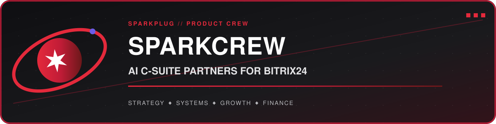

<div align="center">



[🚀 Visitar SparkCrew](https://sparkcrew.jorgesuarez.com.mx) · [🐙 Ver código](https://github.com/jorgefsb/sparkcrew-landing) · **Estado:** landing pública / waitlist

</div>

## ⚡ ¿Qué es SparkCrew?

SparkCrew explora una idea concreta: llevar un equipo de partners de IA —con roles de CEO, CTO, CRO, CMO y CFO— al espacio de trabajo de una PyME en Bitrix24.

Este repositorio contiene la **landing page pública**, no el producto completo. Aquí viven la propuesta, los perfiles del crew, el flujo de waitlist y la página de confirmación.

## 🎮 El crew

| Rol | Enfoque |
|---|---|
| CEO Partner | Decisiones y dirección estratégica |
| CTO Partner | Arquitectura y estrategia tecnológica |
| CRO Partner | Ventas, oferta y crecimiento de ingresos |
| CMO Partner | Marketing y adquisición |
| CFO Partner | Planeación y claridad financiera |

## 🛠️ Stack

- HTML semántico
- CSS responsivo y animaciones
- JavaScript sin framework
- Formspree para el formulario de waitlist
- Cloudflare Workers para servir los assets estáticos

## 🚀 Ejecutar localmente

```bash
git clone https://github.com/jorgefsb/sparkcrew-landing.git
cd sparkcrew-landing
python3 -m http.server 3000
```

Abre `http://localhost:3000`.

## 🗺️ Estructura

```text
sparkcrew-landing/
├── index.html        # Landing principal
├── thank-you.html    # Confirmación de waitlist
├── style.css         # Sistema visual y responsive
├── script.js         # Interacciones y animación
└── CNAME             # Dominio público
```

## 🤝 Feedback

¿Ves una mejora clara en la experiencia, accesibilidad o copy? Abre un issue con el contexto y, si puedes, una propuesta concreta. Bienvenida la partida co-op.

---

SparkCrew es un experimento de producto de [Sparkplug Technologies](https://getsparkplug.com). El banner del repositorio sigue el sistema oficial Sparkplug: Cosmos, Sparkplug Red, órbita y acento Plasma.
